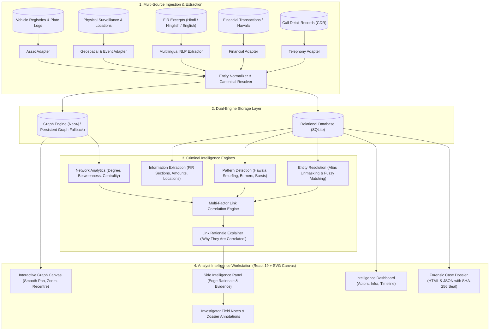

# Sutradhar (सूत्रधार)

### Multi-Source Criminal Network Analysis & Threat Intelligence Platform

[](https://fastapi.tiangolo.com)
[](https://react.dev)
[](https://vitejs.dev)
[](https://tailwindcss.com)
[](https://neo4j.com)
[](https://python.org)

**Sutradhar** (*Sanskrit: "सूत्रधार" — The Orchestrator / Thread-Holder*) is an end-to-end criminal network analysis and investigative intelligence platform designed for law enforcement, cybercrime units, and intelligence analysts.

The platform ingests heterogeneous, multi-source records (Call Detail Records [CDRs], suspicious financial transactions, police FIR excerpts in Hindi/Hinglish/English, surveillance logs, vehicle registries, and darknet threat records), resolves entity aliases across fragmented data, extracts hidden criminal linkages, detects organizational patterns (kingpins, money mules, burner phones), and renders an interactive, explainable relational graph for investigators.

---

## 🏛️ System Architecture



---

## ⚡ Core Capabilities

### 1. 🔍 Multi-Source Entity Resolution & Alias Unmasking
- Discovers aliases, code names, and multiple phone numbers belonging to the same individual.
- Matches fragmented identifiers across platforms (phone numbers, PGP keys, Bitcoin wallets, vehicle registration numbers, and handles).
- Flags high-confidence matches while maintaining audit provenance.

### 2. 🧠 Multilingual NLP & FIR Extraction
- Extracts structured intelligence from unstructured police reports and intercepts written in **English, Hindi, and Hinglish**.
- Extracts IPC/BNS offence sections (e.g., IPC 302, 384, 420, NDPS Act), currency values (INR amounts), dates, locations (e.g., Noida Sector 62, Okhla, Vasant Kunj), and vehicle plates.

### 3. 🕸️ Criminal Pattern Detection & Network Centrality
- **Kingpin & Broker Identification**: Calculates Betweenness, Degree, and Eigenvector centralities to find syndicate coordinators and communication bridges.
- **Hawala & Money Laundering Detection**: Identifies rapid structuring/smurfing transactions across accounts.
- **Burner Phone Switching**: Detects sudden drops in IMEI/IMSI usage synchronized with the activation of a new number.
- **Meeting & Surveillance Clustering**: Flags co-location of suspects at critical timestamps.

### 4. 🔗 Explainable Link Intelligence & "Why They Are Correlated"
- Clicking any edge in the graph reveals plain-language reasoning (e.g., *"Frequent call bursts (14 calls) preceding financial transfer of ₹2,50,000"*).
- Displays supporting evidence cards with transaction amounts, timestamps, and observed channels.

### 5. 📝 Investigator Field Notes & Case Dossier Export
- Investigators can annotate findings directly on specific entity relationships.
- Relationship notes automatically compile into the official **Case Dossier (`GET /api/cases/{case_id}/export/dossier`)** and machine-readable JSON formats with cryptographic SHA-256 integrity seal.

### 6. 🌐 Modernized Analyst Workstation UI
- **Recentre Graph**: Instant one-click focus and zoom reset to fit all nodes and links on screen.
- **Edge Hit-Detection**: Easy-to-click connection lines with visual highlighting.
- **Neighborhood Spotlight**: Isolates connected criminal rings while dimming irrelevant nodes.
- **Bilingual Interface**: Full support for English and Hindi (हिंदी).
- **Responsive Layout**: Designed with comfortable clearances so fixed navigation bars never obscure notes or details.

---

## 📁 Repository Structure

```
Sutradhar/
├── backend/                        # FastAPI Python Backend
│   ├── analytics/                  # Intelligence & Analytics Engines
│   │   ├── coordination.py         # Coordinated activity detection
│   │   ├── entity_resolution.py    # Cross-source entity disambiguation
│   │   ├── explanation.py          # Plain-language correlation rationale
│   │   ├── network_analytics.py    # Centrality & graph metrics
│   │   ├── nlp_extraction.py       # Multilingual NLP (Hindi/Hinglish/English)
│   │   └── pattern_detection.py    # Hawala, burner switch, burst detection
│   ├── database/                   # Storage Layer
│   │   ├── neo4j_client.py         # Neo4j client with persistent fallback
│   │   └── sqlite.py               # SQLite schema & queries
│   ├── replay/                     # Event replay engine
│   ├── routers/                    # REST API Endpoints
│   │   ├── cases.py                # Case management & analytics
│   │   ├── export.py               # Dossier HTML & JSON exports
│   │   ├── notes.py                # Investigator field notes
│   │   └── frontend_router.py      # Frontend routing helper
│   ├── synthetic/                  # Synthetic dataset generator
│   │   ├── dataset_loader.py       # Multi-source CSV & report loader
│   │   └── generate_criminal_network_dataset.py # Realistic data generator
│   ├── verify_criminal_network.py  # End-to-end verification suite
│   ├── user_guide.html             # Interactive HTML user guide
│   ├── main.py                     # FastAPI application factory
│   └── requirements.txt            # Python dependencies
│
├── frontend/                       # Vite + React 19 + Tailwind CSS
│   ├── public/                     # Public assets (logo.png)
│   ├── src/
│   │   ├── assets/                 # App icons and imagery
│   │   ├── components/             # Reusable UI components
│   │   │   ├── LangToggle.jsx      # Language switch (EN / HI)
│   │   │   ├── NextStepsBar.jsx    # Suggested next steps navigation
│   │   │   ├── OnboardingTour.jsx  # Interactive analyst walkthrough
│   │   │   └── SummaryFab.jsx      # Quick summary action button
│   │   ├── lib/                    # API client, context, i18n
│   │   ├── screens/                # Core Application Screens
│   │   │   ├── AuthScreen.jsx      # Authentication & badge sign-in
│   │   │   ├── SelectionScreen.jsx # Case selection & creation
│   │   │   ├── IngestionScreen.jsx # Multi-source data ingestion
│   │   │   ├── DashboardScreen.jsx # Actor & infrastructure dashboard
│   │   │   └── GraphScreen.jsx     # Interactive criminal network graph
│   │   ├── App.jsx                 # Main application controller
│   │   └── index.css               # Design system & dark theme tokens
│   ├── package.json
│   └── vite.config.js
│
├── dataset/                        # Multi-Source Intelligence Datasets
│   ├── cdr.csv                     # Call Detail Records
│   ├── transactions.csv            # Financial & Hawala transactions
│   ├── persons.csv                 # Known persons & suspects
│   ├── phones.csv                  # Registered & burner phone numbers
│   ├── vehicles.csv                # Vehicle registrations & plates
│   ├── locations.csv               # Known safehouses & meeting sites
│   ├── surveillance_events.csv     # Physical surveillance logs
│   ├── incidents.csv               # FIR records
│   ├── reports/                    # Unstructured field & intelligence reports
│   └── ground_truth.json           # Validated criminal syndicate ground truth
│
└── README.md                       # System documentation
```

---

## 🚀 Quickstart & Setup Guide

### Prerequisites
- **Python 3.10, 3.11, or 3.12**
- **Node.js 18+** and `npm`
- *(Optional)* **Neo4j 5.0+** (The system automatically runs with SQLite graph persistence if Neo4j is not installed).

---

### 1. Clone the Repository

```bash
git clone https://github.com/Sneha07k/Sutradhar.git
cd Sutradhar
```

---

### 2. Backend Setup

Create and activate a virtual environment, install dependencies, and start the FastAPI server:

```powershell
# Windows (PowerShell)
python -m venv .venv
.venv\Scripts\Activate.ps1
pip install -r backend/requirements.txt

# Start Backend Server (Port 8000)
uvicorn backend.main:app --reload --port 8000
```

- Interactive OpenAPI / Swagger documentation: **`http://localhost:8000/docs`**

---

### 3. Frontend Setup

In a new terminal window, navigate to `frontend`, install packages, and launch Vite:

```powershell
cd frontend
npm install
npm run dev
```

- Access the analyst workstation in your browser: **`http://localhost:5173`**

---

## 🧪 Verification & Health Check

Run the built-in end-to-end verification script to validate multi-source ingestion, entity resolution, and network correlation:

```powershell
python backend/verify_criminal_network.py
```

---

## 📜 Forensic Case Dossier & Chain of Custody

Sutradhar includes forensic-grade report generation for courtroom readiness:
- **Printable Dossier (`GET /api/cases/{case_id}/export/dossier`)**: Formatted for investigation records, including:
  - Incident & syndicate overview
  - Suspect profile inventory
  - Complete list of investigator relationship notes & evidence
  - Cryptographic **SHA-256 seal** ensuring case state immutability at export time.

